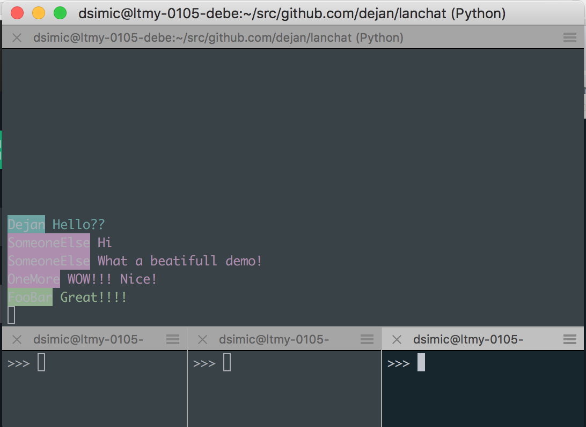

# LAN chat

A simple demo to try out [IP broadcasting](https://en.wikipedia.org/wiki/Broadcast_address) and have serveless chat over LAN.

## Install

    pip install -r requirements.txt

## Watch messages

    python3 watch.py

## Send messages

    python3 send.py <Username>

## Demo

